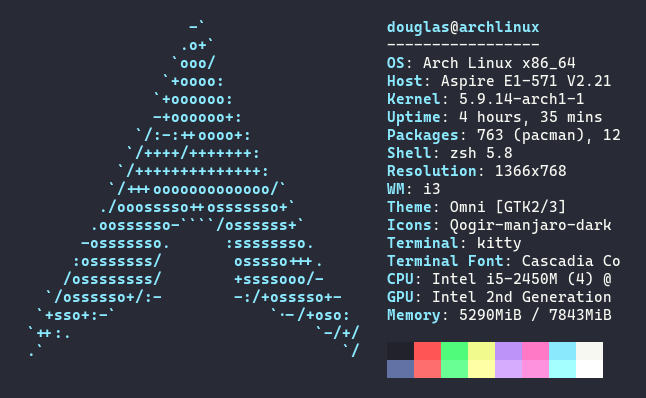
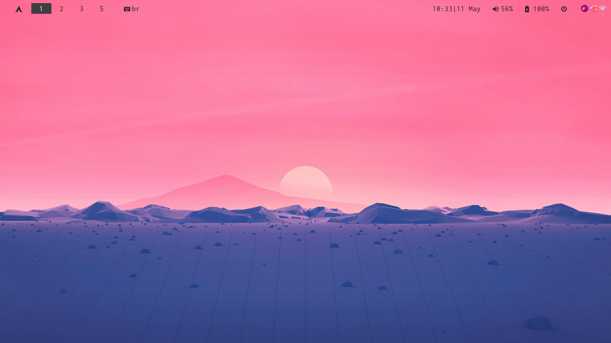
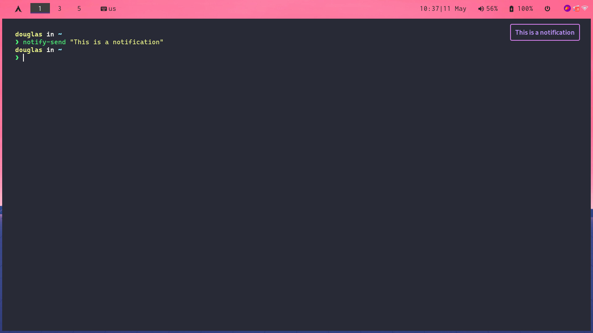
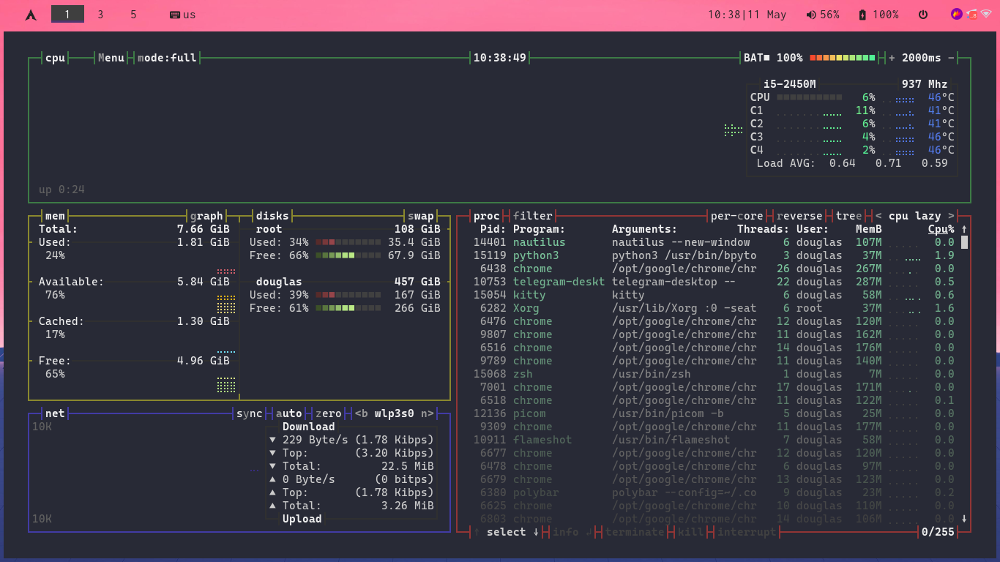

# Dotfiles

<h2>OS</h2>

  

<h2>Images</h2>

  
   
  
   
  

<h2>Used Tools</h2>

- [dunst](https://github.com/dunst-project/dunst)
- [feh](https://feh.finalrewind.org/)
- [i3-gaps](https://github.com/Airblader/i3)
- [kitty](https://sw.kovidgoyal.net/kitty/)
- [picom](https://github.com/yshui/picom)
- [polybar](https://github.com/polybar/polybar)
- [rofi](https://github.com/davatorium/rofi)
